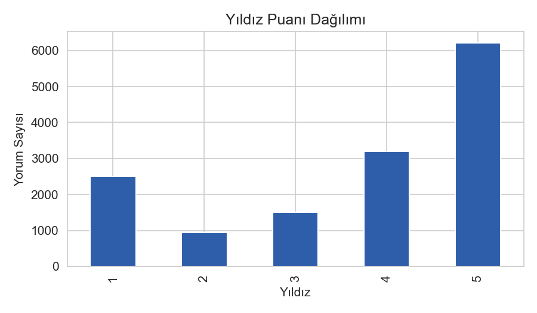
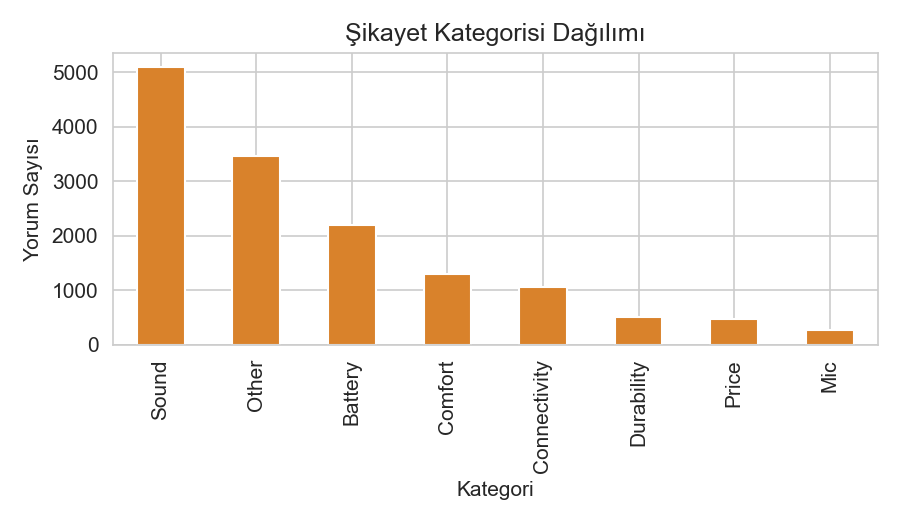
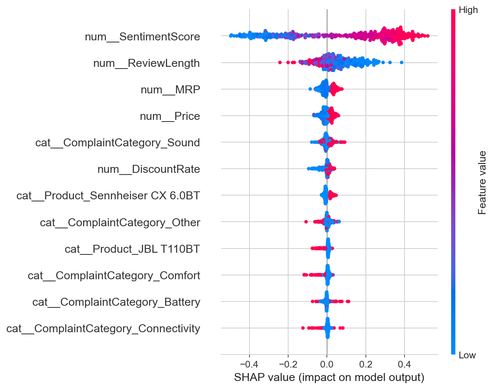

# 🎧 Amazon Kablosuz Kulaklık Ürünlerinde Açıklanabilir Ürün Analitiği

Bu proje, Amazon üzerindeki kablosuz kulaklık müşteri yorumlarını (metin verisi) ve ürün fiyat/indirim bilgilerini (yapılandırılmış veri) birleştirerek müşteri memnuniyetini etkileyen temel unsurları ortaya çıkarmayı ve ürün geliştirme yatırımlarının finansal etkisini ölçmeyi amaçlayan **açıklanabilir bir veri bilimi (XAI)** çalışmasıdır.

Bu çalışma, **Yönetim Bilişim Sistemleri (YBS) Python ile Veri Bilimi** dönem sonu projesi olarak hazırlanmıştır.

---

## 📌 Proje Özeti ve Amacı

Amazon'daki kulaklık yorumları, ürün geliştirme ekipleri için kıymetli fakat yapılandırılmamış bilgiler içerir. Projede geliştirilen veri analitiği boru hattı (pipeline) ile:
- Müşteri yorumlarından duygu durumları ve spesifik şikayet kategorileri türetilmiştir.
- Memnuniyeti (4-5 Yıldız) tahmin eden bir makine öğrenimi modeli kurulmuştur.
- **SHAP (Explainable AI)** analiziyle "kara kutu" modellerin aksine, memnuniyet kararlarını etkileyen en önemli faktörler açıklanmıştır.
- En yüksek memnuniyetsizlik yaratan şikayet alanına (Mikrofon/Arama Kalitesi) odaklanarak, yapılacak iyileştirmenin **ROI (Yatırım Getirisi)** simülasyonu yapılmıştır.

---

## 📊 Proje Bileşenleri ve Analiz Aşamaları

### 1. Veri Harmanlama (Data Fusion)
Projede iki farklı veri seti ürün isimleri üzerinden birleştirilmiştir:
*   `AllProductReviews.csv`: Müşteri yorumları, başlıkları, verilen yıldız puanları ve ürün isimleri.
*   `ProductInfo.csv`: Ürünlerin MRP (liste fiyatı), satış fiyatı ve URL bilgileri.

### 2. Özellik Mühendisliği (Feature Engineering)
Analiz kalitesini ve model başarısını artırmak için iş mantığına dayalı yeni değişkenler türetilmiştir:
*   **Duygu Analizi (Sentiment Analysis):** `vaderSentiment` kütüphanesi kullanılarak yorum metinlerinden -1 ile +1 arasında değişen `SentimentScore` ve buna bağlı `SentimentLabel` (Pozitif/Negatif/Nötr) elde edilmiştir.
*   **Şikayet Kategorizasyonu (Complaint Classification):** Yorumlar anahtar kelimelere göre kural tabanlı olarak 8 farklı kategoriye (Pil, Bağlantı, Ses, Konfor, Mikrofon, Dayanıklılık, Fiyat, Diğer) atanmıştır.
*   **İndirim Oranı (Discount Rate):** Ürünlerin liste fiyatı ile satış fiyatı arasındaki farktan indirim yüzdeleri hesaplanmıştır.
*   **Hedef Değişken (Satisfied):** 4-5 yıldız alan yorumlar "Memnun" (1), 1-3 yıldız alanlar ise "Memnun Değil" (0) olarak etiketlenmiştir.

### 3. Keşifsel Veri Analizi (EDA)
Veri setinin genel analizi sonucu elde edilen bazı çıktılar:
*   **Yıldız Dağılımı:** Müşterilerin memnuniyet oranlarının genel dağılımı.
*   **Kategori Bazlı Memnuniyetsizlik:** En çok mikrofon (`Mic`) ve bağlantı (`Connectivity`) sorunlarının memnuniyetsizlik yarattığı saptanmıştır.

<p align="center">
  
  
</p>

### 4. Makine Öğrenimi ve Açıklanabilir AI (XAI)
Müşteri memnuniyetini tahmin etmek üzere bir **Random Forest Sınıflandırma** modeli kurulmuştur.
*   **Model Başarısı:** Sınıf dengesizliği (class imbalance) giderilmiş ve yüksek doğruluk oranlarına ulaşılmıştır.
*   **SHAP Analizi:** Model kararlarının şeffaflığı için TreeExplainer kullanılmıştır. SHAP analizi, memnuniyet üzerindeki en baskıcı unsurun fiyattan ziyade yorumlardaki **duygu skoru (SentimentScore)** olduğunu göstermektedir.

<p align="center">
  
</p>

### 5. Karar Destek ve Finansal Simülasyon (ROI)
Müşterilerin en çok şikayetçi olduğu mikrofon kalitesi problemi ele alınmıştır. Mikrofon kalitesinin iyileştirilmesinin, dönüşüm oranlarında (conversion rate) yaratacağı artış simüle edilerek **%373 oranında bir Yatırım Getirisi (ROI)** elde edilebileceği ortaya konmuştur. Bu durum, Ar-Ge yatırımlarının nereye yönlendirilmesi gerektiğine dair finansal bir kanıt sunmaktadır.

---

## 📂 Proje Dizin Yapısı

```text
├── AllProductReviews.csv               # Ham müşteri yorumları verisi
├── ProductInfo.csv                     # Ham ürün fiyat/bilgi verisi
├── Amazon_Kablosuz_Kulaklik_Urun_Analitigi.ipynb  # Ana analiz ve modelleme notebook'u
├── generate_report_assets.py           # Analiz grafiklerini ve veri dosyalarını oluşturan betik
├── build_report.py                     # Analiz sonuçlarını Word/PDF raporuna dönüştüren betik
├── Yonetici_Ozeti_Raporu.docx          # Python-docx ile otomatik üretilen rapor
├── Yonetici_Ozeti_Raporu.pdf           # Projenin PDF formatındaki raporu
└── report_assets/                      # Analizlerde üretilen grafikler ve veri çıktıları
    ├── 01_star_distribution.png
    ├── 02_correlation_heatmap.png
    ├── 03_complaint_category.png
    ├── 04_category_satisfaction.png
    ├── 05_confusion_matrix.png
    ├── 06_shap_summary.png
    └── results.json                    # Araç betikleri için ortak analiz sonuçları veri dosyası
```

---

## 🚀 Çalıştırma ve Kurulum Talimatları

### Gerekli Kütüphaneler
Projeyi çalıştırmadan önce aşağıdaki kütüphanelerin bilgisayarınızda yüklü olduğundan emin olun:

```bash
pip install pandas numpy matplotlib seaborn vaderSentiment scikit-learn shap python-docx
```

### Adım Adım Çalıştırma

1.  **Analiz Verilerini ve Grafikleri Yeniden Üretmek İçin:**
    ```bash
    python generate_report_assets.py
    ```
    *Bu komut, tüm veri görselleştirmelerini (`report_assets/` altına) ve makine öğrenimi modeli sonuçlarını içeren `results.json` dosyasını oluşturur.*

2.  **Yönetici Raporunu (Word formatında) Oluşturmak İçin:**
    ```bash
    python build_report.py
    ```
    *Bu komut, `results.json` ve grafik dosyalarını kullanarak `Yonetici_Ozeti_Raporu.docx` dosyasını profesyonel bir sayfa yapısı ve renk paleti ile otomatik olarak üretir.*

---

## 🛠️ Kullanılan Teknolojiler

*   **Programlama Dili:** Python
*   **Veri Analitiği:** Pandas, NumPy
*   **Görselleştirme:** Matplotlib, Seaborn
*   **Duygu Analizi (NLP):** VADER Sentiment Analyzer
*   **Makine Öğrenimi:** Scikit-Learn (Random Forest)
*   **Açıklanabilir Yapay Zeka (XAI):** SHAP (SHapley Additive exPlanations)
*   **Raporlama:** Python-docx (Microsoft Word Raporlama Otomasyonu)
